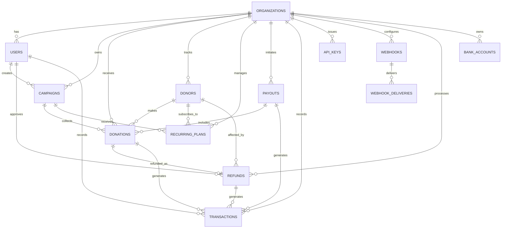

# ERD.md — Entity Relationship Diagram

## nofund — Fundraising & Donation Management Platform

**Version:** 1.0  
**Date:** 2026-06-09  
**Status:** Draft

---

## 1. Legend

| Symbol | Meaning |
|--------|---------|
| `PK` | Primary Key |
| `FK` | Foreign Key |
| `UQ` | Unique |
| `IDX` | Indexed |
| `NULL` | Nullable |
| `COMP` | Computed / Virtual |
| `1` | One |
| `N` | Many |
| `0..1` | Zero or One |
| `1..N` | One or Many |
| `0..N` | Zero or Many |

---

## 2. High-Level ERD (Mermaid)



---

## 3. Detailed ERD (Mermaid)

```mermaid
erDiagram
    %% ========== ORGANIZATIONS ==========
    ORGANIZATIONS {
        uuid id PK
        string public_id "UQ, NOT NULL"
        string name
        string slug UQ
        enum type "mosque, ngo, charity, community, individual"
        string logo_url NULL
        text description NULL
        string contact_email
        string contact_phone NULL
        json address NULL
        string timezone "default: Asia/Kuala_Lumpur"
        string currency "default: MYR"
        enum status "active, suspended, deactivated"
        uuid plan_id FK NULL
        timestamp created_at
        timestamp updated_at
        timestamp deleted_at NULL
    }

    %% ========== USERS ==========
    USERS {
        uuid id PK
        string public_id "UQ, NOT NULL"
        string name
        string email UQ
        timestamp email_verified_at NULL
        string password
        string avatar_url NULL
        enum role "super_admin, admin, manager, viewer"
        enum status "active, invited, deactivated"
        uuid organization_id FK
        timestamp last_login_at NULL
        timestamp created_at
        timestamp updated_at
    }

    %% ========== CAMPAIGNS ==========
    CAMPAIGNS {
        uuid id PK
        string public_id "UQ, NOT NULL"
        uuid organization_id FK
        string title
        string slug
        text description NULL
        string cover_image_url NULL
        decimal target_amount "10,2"
        decimal raised_amount COMP "10,2"
        integer donor_count COMP
        enum status "draft, active, paused, completed"
        enum visibility "public, unlisted, private"
        string category
        date start_date NULL
        date end_date NULL
        text embed_code NULL
        json meta NULL
        uuid created_by FK
        timestamp created_at
        timestamp updated_at
        timestamp deleted_at NULL
    }

    %% ========== DONATIONS ==========
    DONATIONS {
        uuid id PK
        string public_id "UQ, NOT NULL"
        uuid organization_id FK
        uuid campaign_id FK NULL
        uuid donor_id FK NULL
        decimal amount "10,2"
        string currency "default: MYR"
        enum status "pending, succeeded, failed, refunded"
        enum payment_method "card, bank_transfer, ewallet, cash"
        string payment_gateway
        string gateway_transaction_id
        json gateway_response NULL
        boolean is_anonymous
        string donor_name
        string donor_email
        string donor_phone NULL
        text donor_message NULL
        decimal refunded_amount "10,2" "default: 0.00"
        string refund_reason NULL
        boolean receipt_sent "default: false"
        string receipt_url NULL
        string ip_address
        string user_agent
        string source_url NULL
        json meta NULL
        timestamp created_at
        timestamp updated_at
    }

    %% ========== DONORS ==========
    DONORS {
        uuid id PK
        string public_id "UQ, NOT NULL"
        uuid organization_id FK
        string name
        string email
        string phone NULL
        boolean is_anonymous_preference "default: false"
        decimal total_donated COMP "10,2"
        integer donation_count COMP
        timestamp first_donation_at NULL
        timestamp last_donation_at NULL
        text notes NULL
        json tags NULL
        timestamp created_at
        timestamp updated_at
    }

    %% ========== RECURRING_PLANS ==========
    RECURRING_PLANS {
        uuid id PK
        string public_id "UQ, NOT NULL"
        uuid organization_id FK
        uuid donor_id FK
        uuid campaign_id FK NULL
        decimal amount "10,2"
        string currency "default: MYR"
        enum frequency "weekly, monthly, yearly"
        enum status "active, paused, cancelled, expired"
        date start_date
        date end_date NULL
        date next_charge_date
        integer total_charges "default: 0"
        decimal total_amount "10,2" "default: 0.00"
        string payment_method_token
        string gateway_subscription_id
        json meta NULL
        timestamp created_at
        timestamp updated_at
    }

    %% ========== PAYOUTS ==========
    PAYOUTS {
        uuid id PK
        string public_id "UQ, NOT NULL"
        uuid organization_id FK
        decimal amount "10,2"
        string currency "default: MYR"
        enum status "pending, processing, paid, failed"
        uuid bank_account_id FK
        string gateway_payout_id NULL
        json donations "array of donation IDs"
        string failure_reason NULL
        timestamp paid_at NULL
        timestamp created_at
        timestamp updated_at
    }

    %% ========== TRANSACTIONS ==========
    TRANSACTIONS {
        uuid id PK
        uuid organization_id FK
        string transactionable_type "morph type"
        uuid transactionable_id "morph id"
        enum type "donation, refund, fee, payout, adjustment"
        decimal amount "10,2"
        string currency "default:MYR"
        decimal balance_after "10,2"
        string description
        json meta NULL
        timestamp created_at
    }

    %% ========== REFUNDS ==========
    REFUNDS {
        uuid id PK
        string public_id "UQ, NOT NULL"
        uuid organization_id FK
        uuid donation_id FK UQ
        decimal amount "10,2"
        string currency "default: MYR"
        string reason
        enum status "pending, succeeded, failed"
        string gateway_refund_id NULL
        uuid processed_by FK
        timestamp created_at
        timestamp updated_at
    }

    %% ========== BANK_ACCOUNTS ==========
    BANK_ACCOUNTS {
        uuid id PK
        uuid organization_id FK
        string account_name
        string account_number
        string bank_name
        string bank_code
        enum type "savings, current"
        boolean is_default "default: false"
        enum status "active, inactive"
        timestamp created_at
        timestamp updated_at
    }

    %% ========== API_KEYS ==========
    API_KEYS {
        uuid id PK
        string public_id "UQ, NOT NULL"
        uuid organization_id FK
        string name
        string key_hash
        timestamp last_used_at NULL
        json scopes "array of permissions"
        timestamp revoked_at NULL
        timestamp created_at
        timestamp updated_at
    }

    %% ========== WEBHOOKS ==========
    WEBHOOKS {
        uuid id PK
        string public_id "UQ, NOT NULL"
        uuid organization_id FK
        string url
        string secret
        json events "array of event names"
        enum status "active, paused"
        timestamp last_triggered_at NULL
        timestamp created_at
        timestamp updated_at
    }

    %% ========== WEBHOOK_DELIVERIES ==========
    WEBHOOK_DELIVERIES {
        uuid id PK
        uuid webhook_id FK
        string event
        json payload
        integer response_status NULL
        text response_body NULL
        integer attempt_count "default: 1"
        timestamp delivered_at NULL
        timestamp created_at
    }

    %% ========== ACTIVITY_LOGS ==========
    ACTIVITY_LOGS {
        uuid id PK
        uuid organization_id FK
        uuid user_id FK NULL
        string action
        string subject_type
        uuid subject_id
        json properties NULL
        string ip_address
        timestamp created_at
    }

    %% ========== RELATIONSHIPS ==========
    ORGANIZATIONS ||--o{ USERS : "1 to 0..N"
    ORGANIZATIONS ||--o{ CAMPAIGNS : "1 to 0..N"
    ORGANIZATIONS ||--o{ DONATIONS : "1 to 0..N"
    ORGANIZATIONS ||--o{ DONORS : "1 to 0..N"
    ORGANIZATIONS ||--o{ RECURRING_PLANS : "1 to 0..N"
    ORGANIZATIONS ||--o{ PAYOUTS : "1 to 0..N"
    ORGANIZATIONS ||--o{ TRANSACTIONS : "1 to 0..N"
    ORGANIZATIONS ||--o{ API_KEYS : "1 to 0..N"
    ORGANIZATIONS ||--o{ WEBHOOKS : "1 to 0..N"
    ORGANIZATIONS ||--o{ REFUNDS : "1 to 0..N"
    ORGANIZATIONS ||--o{ BANK_ACCOUNTS : "1 to 0..N"
    ORGANIZATIONS ||--o{ ACTIVITY_LOGS : "1 to 0..N"

    USERS ||--o{ CAMPAIGNS : "1 to 0..N (created_by)"
    USERS ||--o{ REFUNDS : "1 to 0..N (processed_by)"

    CAMPAIGNS ||--o{ DONATIONS : "1 to 0..N"
    CAMPAIGNS ||--o{ RECURRING_PLANS : "1 to 0..N"

    DONORS ||--o{ DONATIONS : "1 to 0..N"
    DONORS ||--o{ RECURRING_PLANS : "1 to 0..N"

    DONATIONS ||--o| REFUNDS : "1 to 0..1"
    DONATIONS ||--o{ TRANSACTIONS : "1 to 0..N"

    PAYOUTS ||--o{ TRANSACTIONS : "1 to 0..N"
    PAYOUTS ||--o{ DONATIONS : "1 to 1..N (JSON ref)"

    REFUNDS ||--o{ TRANSACTIONS : "1 to 0..N"

    WEBHOOKS ||--o{ WEBHOOK_DELIVERIES : "1 to 0..N"

    BANK_ACCOUNTS ||--o{ PAYOUTS : "1 to 0..N"
```

---

## 4. Entity Definitions & Relationships

### 4.1 Organizations

The top-level tenant entity. Every other entity belongs to an organization.

| Attribute | Type | Constraints | Notes |
|-----------|------|-------------|-------|
| id | UUID | PK, auto | |
| public_id | VARCHAR(32) | UQ, NOT NULL | Prefix + 26 alphanumeric chars, e.g. `org_a1b2c3d4e5f6g7h8i9j0k1l2m3` |
| name | VARCHAR(255) | NOT NULL | Display name |
| slug | VARCHAR(255) | UQ, NOT NULL | URL-friendly identifier |
| type | ENUM | NOT NULL | mosque, ngo, charity, community, individual |
| logo_url | VARCHAR(500) | NULL | S3 URL |
| description | TEXT | NULL | Public-facing description |
| contact_email | VARCHAR(255) | NOT NULL | Primary contact |
| contact_phone | VARCHAR(50) | NULL | |
| address | JSON | NULL | Structured address object |
| timezone | VARCHAR(50) | NOT NULL, default "Asia/Kuala_Lumpur" | |
| currency | VARCHAR(3) | NOT NULL, default "MYR" | ISO 4217 |
| status | ENUM | NOT NULL, default "active" | active, suspended, deactivated |
| plan_id | UUID | NULL, FK → plans | Billing plan (future) |

**Relationships:**
- `has_many` → Users (members)
- `has_many` → Campaigns
- `has_many` → Donations
- `has_many` → Donors
- `has_many` → RecurringPlans
- `has_many` → Payouts
- `has_many` → Transactions
- `has_many` → ApiKeys
- `has_many` → Webhooks
- `has_many` → Refunds
- `has_many` → BankAccounts

**Indexes:**
- `public_id` — unique index for public reference
- `slug` — unique index for tenant routing
- `status` — for filtering active organizations

---

### 4.2 Users

Organization members who can access the dashboard.

| Attribute | Type | Constraints | Notes |
|-----------|------|-------------|-------|
| id | UUID | PK, auto | |
| public_id | VARCHAR(32) | UQ, NOT NULL | Prefix + 26 alphanumeric chars, e.g. `usr_a1b2c3d4e5f6g7h8i9j0k1l2m3` |
| name | VARCHAR(255) | NOT NULL | Full name |
| email | VARCHAR(255) | NOT NULL, UQ | Login identifier |
| email_verified_at | TIMESTAMP | NULL | |
| password | VARCHAR(255) | NOT NULL | bcrypt hashed |
| avatar_url | VARCHAR(500) | NULL | Gravatar or uploaded |
| role | ENUM | NOT NULL, default "viewer" | super_admin, admin, manager, viewer |
| status | ENUM | NOT NULL, default "active" | active, invited, deactivated |
| organization_id | UUID | NOT NULL, FK → organizations | |
| last_login_at | TIMESTAMP | NULL | |

**Relationships:**
- `belongs_to` → Organization
- `has_many` → Campaigns (as creator)
- `has_many` → Refunds (as processor)

**Indexes:**
- `public_id` — unique index for public reference
- `email` — unique global index
- `organization_id` — for tenant-scoped queries
- `role` — for RBAC filtering

---

### 4.3 Campaigns

Fundraising campaign created by an organization.

| Attribute | Type | Constraints | Notes |
|-----------|------|-------------|-------|
| id | UUID | PK, auto | |
| public_id | VARCHAR(32) | UQ, NOT NULL | Prefix + 26 alphanumeric chars, e.g. `cmp_a1b2c3d4e5f6g7h8i9j0k1l2m3` |
| organization_id | UUID | NOT NULL, FK → organizations | |
| title | VARCHAR(255) | NOT NULL | |
| slug | VARCHAR(255) | NOT NULL | Unique within org |
| description | TEXT | NULL | Rich text / HTML |
| cover_image_url | VARCHAR(500) | NULL | S3 URL |
| target_amount | DECIMAL(10,2) | NOT NULL, default 0.00 | RM |
| raised_amount | DECIMAL(10,2) | COMP | Sum of succeeded donations |
| donor_count | INT | COMP | Count of unique donors |
| status | ENUM | NOT NULL, default "draft" | draft, active, paused, completed |
| visibility | ENUM | NOT NULL, default "public" | public, unlisted, private |
| category | VARCHAR(100) | NOT NULL | Wakaf, Zakat, etc. |
| start_date | DATE | NULL | |
| end_date | DATE | NULL | |
| embed_code | TEXT | NULL | Auto-generated iframe/HTML |
| meta | JSON | NULL | Flexible metadata |
| created_by | UUID | NOT NULL, FK → users | |

**Relationships:**
- `belongs_to` → Organization
- `belongs_to` → User (creator)
- `has_many` → Donations
- `has_many` → RecurringPlans

**Indexes:**
- `public_id` — unique index for public reference
- `organization_id + slug` — composite unique (tenant-scoped slug)
- `organization_id + status` — for listing active campaigns
- `organization_id + created_at` — for recent sorting

**Constraints:**
- Soft deletes with `deleted_at`
- `end_date` must be >= `start_date` if both present

---

### 4.4 Donations

Individual donation transaction.

| Attribute | Type | Constraints | Notes |
|-----------|------|-------------|-------|
| id | UUID | PK, auto | |
| public_id | VARCHAR(32) | UQ, NOT NULL | Prefix + 26 alphanumeric chars, e.g. `dnt_a1b2c3d4e5f6g7h8i9j0k1l2m3` |
| organization_id | UUID | NOT NULL, FK → organizations | |
| campaign_id | UUID | NULL, FK → campaigns | Nullable for general donations |
| donor_id | UUID | NULL, FK → donors | NULL for guest/anonymous |
| amount | DECIMAL(10,2) | NOT NULL | |
| currency | VARCHAR(3) | NOT NULL, default "MYR" | |
| status | ENUM | NOT NULL, default "pending" | pending, succeeded, failed, refunded |
| payment_method | ENUM | NOT NULL | card, bank_transfer, ewallet, cash |
| payment_gateway | VARCHAR(50) | NOT NULL | stripe, billplz, toyyibpay, cash |
| gateway_transaction_id | VARCHAR(255) | NOT NULL | External reference |
| gateway_response | JSON | NULL | Raw gateway response |
| is_anonymous | BOOLEAN | NOT NULL, default false | |
| donor_name | VARCHAR(255) | NOT NULL | Snapshot at time of donation |
| donor_email | VARCHAR(255) | NOT NULL | Snapshot |
| donor_phone | VARCHAR(50) | NULL | Snapshot |
| donor_message | TEXT | NULL | |
| refunded_amount | DECIMAL(10,2) | NOT NULL, default 0.00 | |
| refund_reason | VARCHAR(500) | NULL | |
| receipt_sent | BOOLEAN | NOT NULL, default false | |
| receipt_url | VARCHAR(500) | NULL | S3 PDF URL |
| ip_address | VARCHAR(45) | NOT NULL | IPv4/IPv6 |
| user_agent | TEXT | NOT NULL | |
| source_url | VARCHAR(500) | NULL | Referring page |
| meta | JSON | NULL | UTM params, etc. |

**Relationships:**
- `belongs_to` → Organization
- `belongs_to` → Campaign (optional)
- `belongs_to` → Donor (optional)
- `has_one` → Refund (via donation_id)
- `morph_many` → Transaction (as transactionable)

**Indexes:**
- `public_id` — unique index for public reference
- `organization_id + status` — dashboard queries
- `organization_id + campaign_id` — campaign detail
- `organization_id + created_at` — recent donations
- `gateway_transaction_id` — webhook lookup
- `donor_id` — donor history

---

### 4.5 Donors

Aggregated donor profile within an organization.

| Attribute | Type | Constraints | Notes |
|-----------|------|-------------|-------|
| id | UUID | PK, auto | |
| public_id | VARCHAR(32) | UQ, NOT NULL | Prefix + 26 alphanumeric chars, e.g. `dor_a1b2c3d4e5f6g7h8i9j0k1l2m3` |
| organization_id | UUID | NOT NULL, FK → organizations | |
| name | VARCHAR(255) | NOT NULL | Display name |
| email | VARCHAR(255) | NOT NULL | |
| phone | VARCHAR(50) | NULL | |
| is_anonymous_preference | BOOLEAN | NOT NULL, default false | Default for new donations |
| total_donated | DECIMAL(10,2) | COMP | Sum of all succeeded donations |
| donation_count | INT | COMP | Count of donations |
| first_donation_at | TIMESTAMP | NULL | |
| last_donation_at | TIMESTAMP | NULL | |
| notes | TEXT | NULL | Internal notes |
| tags | JSON | NULL | Array of strings |

**Relationships:**
- `belongs_to` → Organization
- `has_many` → Donations
- `has_many` → RecurringPlans

**Indexes:**
- `public_id` — unique index for public reference
- `organization_id + email` — composite (donor lookup within org)
- `organization_id + total_donated` — for top donors

---

### 4.6 RecurringPlans

Subscription-style recurring donation plan.

| Attribute | Type | Constraints | Notes |
|-----------|------|-------------|-------|
| id | UUID | PK, auto | |
| public_id | VARCHAR(32) | UQ, NOT NULL | Prefix + 26 alphanumeric chars, e.g. `rpl_a1b2c3d4e5f6g7h8i9j0k1l2m3` |
| organization_id | UUID | NOT NULL, FK → organizations | |
| donor_id | UUID | NOT NULL, FK → donors | |
| campaign_id | UUID | NULL, FK → campaigns | Optional campaign association |
| amount | DECIMAL(10,2) | NOT NULL | |
| currency | VARCHAR(3) | NOT NULL, default "MYR" | |
| frequency | ENUM | NOT NULL | weekly, monthly, yearly |
| status | ENUM | NOT NULL, default "active" | active, paused, cancelled, expired |
| start_date | DATE | NOT NULL | |
| end_date | DATE | NULL | Optional termination date |
| next_charge_date | DATE | NOT NULL | Used by scheduler |
| total_charges | INT | NOT NULL, default 0 | Counter |
| total_amount | DECIMAL(10,2) | NOT NULL, default 0.00 | |
| payment_method_token | VARCHAR(255) | NOT NULL | Gateway token (masked in logs) |
| gateway_subscription_id | VARCHAR(255) | NOT NULL | External subscription ID |
| meta | JSON | NULL | |

**Relationships:**
- `belongs_to` → Organization
- `belongs_to` → Donor
- `belongs_to` → Campaign (optional)

**Indexes:**
- `public_id` — unique index for public reference
- `organization_id + status` — active plans
- `next_charge_date` — scheduler query
- `gateway_subscription_id` — gateway webhook lookup

---

### 4.7 Payouts

Transfer of collected funds to organization's bank account.

| Attribute | Type | Constraints | Notes |
|-----------|------|-------------|-------|
| id | UUID | PK, auto | |
| public_id | VARCHAR(32) | UQ, NOT NULL | Prefix + 26 alphanumeric chars, e.g. `pyt_a1b2c3d4e5f6g7h8i9j0k1l2m3` |
| organization_id | UUID | NOT NULL, FK → organizations | |
| amount | DECIMAL(10,2) | NOT NULL | |
| currency | VARCHAR(3) | NOT NULL, default "MYR" | |
| status | ENUM | NOT NULL, default "pending" | pending, processing, paid, failed |
| bank_account_id | UUID | NOT NULL, FK → bank_accounts | |
| gateway_payout_id | VARCHAR(255) | NULL | External reference |
| donations | JSON | NOT NULL | Array of donation UUIDs |
| failure_reason | VARCHAR(500) | NULL | |
| paid_at | TIMESTAMP | NULL | |

**Relationships:**
- `belongs_to` → Organization
- `belongs_to` → BankAccount
- `morph_many` → Transaction (as transactionable)
- JSON reference to → Donation[]

**Indexes:**
- `public_id` — unique index for public reference
- `organization_id + status` — pending payouts
- `gateway_payout_id` — webhook lookup

---

### 4.8 Transactions

Immutable financial ledger entry. Polymorphic — can belong to a Donation, Refund, Payout, or Fee.

| Attribute | Type | Constraints | Notes |
|-----------|------|-------------|-------|
| id | UUID | PK, auto | |
| organization_id | UUID | NOT NULL, FK → organizations | |
| transactionable_type | VARCHAR(100) | NOT NULL | model class name |
| transactionable_id | UUID | NOT NULL | |
| type | ENUM | NOT NULL | donation, refund, fee, payout, adjustment |
| amount | DECIMAL(10,2) | NOT NULL | Positive for credit, negative for debit |
| currency | VARCHAR(3) | NOT NULL, default "MYR" | |
| balance_after | DECIMAL(10,2) | NOT NULL | Running balance |
| description | VARCHAR(500) | NOT NULL | Human-readable |
| meta | JSON | NULL | |

**Relationships:**
- `belongs_to` → Organization
- `morph_to` → transactionable (Donation, Refund, Payout)

**Indexes:**
- `organization_id + type` — ledger queries
- `transactionable_type + transactionable_id` — polymorphic lookup
- `organization_id + created_at` — chronological ledger

**Constraints:**
- Never update or delete — append-only ledger

---

### 4.9 Refunds

Refund record linked to a donation.

| Attribute | Type | Constraints | Notes |
|-----------|------|-------------|-------|
| id | UUID | PK, auto | |
| public_id | VARCHAR(32) | UQ, NOT NULL | Prefix + 26 alphanumeric chars, e.g. `ref_a1b2c3d4e5f6g7h8i9j0k1l2m3` |
| organization_id | UUID | NOT NULL, FK → organizations | |
| donation_id | UUID | NOT NULL, UQ, FK → donations | One refund per donation |
| amount | DECIMAL(10,2) | NOT NULL | |
| currency | VARCHAR(3) | NOT NULL, default "MYR" | |
| reason | VARCHAR(500) | NOT NULL | |
| status | ENUM | NOT NULL, default "pending" | pending, succeeded, failed |
| gateway_refund_id | VARCHAR(255) | NULL | External reference |
| processed_by | UUID | NOT NULL, FK → users | Admin who initiated |

**Relationships:**
- `belongs_to` → Organization
- `belongs_to` → Donation
- `belongs_to` → User (processor)
- `morph_many` → Transaction (as transactionable)

**Indexes:**
- `public_id` — unique index for public reference
- `donation_id` — unique, one refund per donation
- `organization_id + status` — refund list

---

### 4.10 BankAccounts

Organization bank account for payouts.

| Attribute | Type | Constraints | Notes |
|-----------|------|-------------|-------|
| id | UUID | PK, auto | |
| organization_id | UUID | NOT NULL, FK → organizations | |
| account_name | VARCHAR(255) | NOT NULL | Holder name |
| account_number | VARCHAR(50) | NOT NULL | Masked in UI |
| bank_name | VARCHAR(100) | NOT NULL | Maybank, CIMB, etc. |
| bank_code | VARCHAR(20) | NOT NULL | For API routing |
| type | ENUM | NOT NULL | savings, current |
| is_default | BOOLEAN | NOT NULL, default false | |
| status | ENUM | NOT NULL, default "active" | active, inactive |

**Relationships:**
- `belongs_to` → Organization
- `has_many` → Payouts

**Indexes:**
- `organization_id + is_default` — quick lookup for default account

---

### 4.11 ApiKeys

API key for programmatic access.

| Attribute | Type | Constraints | Notes |
|-----------|------|-------------|-------|
| id | UUID | PK, auto | |
| public_id | VARCHAR(32) | UQ, NOT NULL | Prefix + 26 alphanumeric chars, e.g. `key_a1b2c3d4e5f6g7h8i9j0k1l2m3` |
| organization_id | UUID | NOT NULL, FK → organizations | |
| name | VARCHAR(255) | NOT NULL | Descriptive label |
| key_hash | VARCHAR(255) | NOT NULL | bcrypt of the key |
| last_used_at | TIMESTAMP | NULL | |
| scopes | JSON | NOT NULL | ["read:campaigns", "write:donations"] |
| revoked_at | TIMESTAMP | NULL | Soft revoke |

**Relationships:**
- `belongs_to` → Organization

**Indexes:**
- `public_id` — unique index for public reference
- `key_hash` — authentication lookup

**Constraints:**
- Never expose key_hash; only show plaintext key once on creation

---

### 4.12 Webhooks

Webhook endpoint configuration.

| Attribute | Type | Constraints | Notes |
|-----------|------|-------------|-------|
| id | UUID | PK, auto | |
| public_id | VARCHAR(32) | UQ, NOT NULL | Prefix + 26 alphanumeric chars, e.g. `whk_a1b2c3d4e5f6g7h8i9j0k1l2m3` |
| organization_id | UUID | NOT NULL, FK → organizations | |
| url | VARCHAR(500) | NOT NULL | HTTPS only |
| secret | VARCHAR(255) | NOT NULL | HMAC signing key |
| events | JSON | NOT NULL | ["donation.succeeded"] |
| status | ENUM | NOT NULL, default "active" | active, paused |
| last_triggered_at | TIMESTAMP | NULL | |

**Relationships:**
- `belongs_to` → Organization
- `has_many` → WebhookDelivery

**Indexes:**
- `public_id` — unique index for public reference
- `organization_id + status` — active webhooks

---

### 4.13 WebhookDeliveries

Individual webhook delivery attempt log.

| Attribute | Type | Constraints | Notes |
|-----------|------|-------------|-------|
| id | UUID | PK, auto | |
| webhook_id | UUID | NOT NULL, FK → webhooks | |
| event | VARCHAR(100) | NOT NULL | e.g. "donation.succeeded" |
| payload | JSON | NOT NULL | Full event payload |
| response_status | INT | NULL | HTTP status from endpoint |
| response_body | TEXT | NULL | Truncated response |
| attempt_count | INT | NOT NULL, default 1 | Retry counter |
| delivered_at | TIMESTAMP | NULL | NULL until successful |

**Relationships:**
- `belongs_to` → Webhook

**Indexes:**
- `webhook_id + delivered_at` — delivery history
- `delivered_at IS NULL` — pending/redelivery queue (partial index)

---

### 4.14 ActivityLogs

Audit trail for all organization actions.

| Attribute | Type | Constraints | Notes |
|-----------|------|-------------|-------|
| id | UUID | PK, auto | |
| organization_id | UUID | NOT NULL, FK → organizations | |
| user_id | UUID | NULL, FK → users | System actions may be NULL |
| action | VARCHAR(100) | NOT NULL | e.g. "refund.created" |
| subject_type | VARCHAR(100) | NOT NULL | Model class |
| subject_id | UUID | NOT NULL | |
| properties | JSON | NULL | Before/after diff |
| ip_address | VARCHAR(45) | NOT NULL | |

**Relationships:**
- `belongs_to` → Organization
- `belongs_to` → User (optional)
- `morph_to` → subject

**Indexes:**
- `organization_id + created_at` — audit queries
- `subject_type + subject_id` — "show me all activity on this record"

**Constraints:**
- Append-only, never update or delete

---

## 5. Relationship Cardinality Summary

| From | Relationship | To | Cardinality | Notes |
|------|-------------|-----|-------------|-------|
| Organization | has_many | Users | 1 → 0..N | Members of the org |
| Organization | has_many | Campaigns | 1 → 0..N | |
| Organization | has_many | Donations | 1 → 0..N | |
| Organization | has_many | Donors | 1 → 0..N | |
| Organization | has_many | RecurringPlans | 1 → 0..N | |
| Organization | has_many | Payouts | 1 → 0..N | |
| Organization | has_many | BankAccounts | 1 → 0..N | |
| Organization | has_many | Transactions | 1 → 0..N | Immutable ledger |
| Organization | has_many | Refunds | 1 → 0..N | |
| Organization | has_many | ApiKeys | 1 → 0..N | |
| Organization | has_many | Webhooks | 1 → 0..N | |
| Organization | has_many | ActivityLogs | 1 → 0..N | Audit trail |
| User | belongs_to | Organization | N → 1 | |
| User | has_many | Campaigns | 1 → 0..N | As creator |
| User | has_many | Refunds | 1 → 0..N | As processor |
| Campaign | belongs_to | Organization | N → 1 | |
| Campaign | belongs_to | User | N → 1 | Creator |
| Campaign | has_many | Donations | 1 → 0..N | |
| Campaign | has_many | RecurringPlans | 1 → 0..N | |
| Donation | belongs_to | Organization | N → 1 | |
| Donation | belongs_to | Campaign | N → 0..1 | Optional |
| Donation | belongs_to | Donor | N → 0..1 | Optional (guest) |
| Donation | has_one | Refund | 1 → 0..1 | Max one refund |
| Donation | morphs_to | Transaction | 1 → 0..N | Ledger entries |
| Donor | belongs_to | Organization | N → 1 | |
| Donor | has_many | Donations | 1 → 0..N | |
| Donor | has_many | RecurringPlans | 1 → 0..N | |
| RecurringPlan | belongs_to | Organization | N → 1 | |
| RecurringPlan | belongs_to | Donor | N → 1 | |
| RecurringPlan | belongs_to | Campaign | N → 0..1 | Optional |
| Payout | belongs_to | Organization | N → 1 | |
| Payout | belongs_to | BankAccount | N → 1 | |
| Payout | morphs_to | Transaction | 1 → 0..N | |
| Payout | references | Donation | 1 → 1..N | Via JSON array |
| BankAccount | belongs_to | Organization | N → 1 | |
| BankAccount | has_many | Payouts | 1 → 0..N | |
| Refund | belongs_to | Organization | N → 1 | |
| Refund | belongs_to | Donation | 1 → 1 | Exactly one donation |
| Refund | belongs_to | User | N → 1 | Processor |
| Refund | morphs_to | Transaction | 1 → 0..N | |
| ApiKey | belongs_to | Organization | N → 1 | |
| Webhook | belongs_to | Organization | N → 1 | |
| Webhook | has_many | WebhookDelivery | 1 → 0..N | |
| WebhookDelivery | belongs_to | Webhook | N → 1 | |

---

## 6. Indexes Strategy

### 6.1 High-Frequency Query Indexes

| Query Pattern | Table | Index |
|--------------|-------|-------|
| Dashboard stats | donations | `(organization_id, status, created_at)` |
| Campaign donations | donations | `(campaign_id, status, created_at)` |
| Donor history | donations | `(donor_id, created_at DESC)` |
| Active campaigns | campaigns | `(organization_id, status, created_at)` |
| Donor search | donors | `(organization_id, email)` — unique |
| Webhook lookup | donations | `(gateway_transaction_id)` |
| Recurring scheduler | recurring_plans | `(status, next_charge_date)` |
| Payout list | payouts | `(organization_id, created_at DESC)` |
| Transaction ledger | transactions | `(organization_id, created_at DESC)` |
| Activity audit | activity_logs | `(organization_id, created_at DESC)` |

### 6.2 Full-Text Search

| Table | Fields | Engine |
|-------|--------|--------|
| campaigns | title, description | Meilisearch / pg_search |
| donors | name, email | Meilisearch / pg_search |
| donations | donor_name, donor_email, donor_message | pg_search |

---

## 7. Constraints & Business Rules

### 7.1 Database-Level Constraints

```sql
-- Campaign slug uniqueness per organization
UNIQUE (organization_id, slug)

-- One refund per donation
UNIQUE (donation_id)

-- Positive amounts for donations, payouts
CHECK (amount >= 0)

-- Campaign end date must be after start date
CHECK (end_date IS NULL OR end_date >= start_date)

-- Recurring plan next_charge_date must be >= start_date
CHECK (next_charge_date >= start_date)
```

### 7.2 Application-Level Rules

| Rule | Enforcement |
|------|-------------|
| A donation can only be refunded if status = succeeded | Application validation + DB trigger |
| Refund amount cannot exceed donation amount | Application validation |
| A payout can only include succeeded, non-refunded donations | Application logic |
| An organization must have at least one admin user | Application logic (prevent last-admin deletion) |
| API keys are scoped to their organization | Middleware |
| Webhook URLs must use HTTPS | Application validation |
| Campaign slug auto-generated from title if not provided | Model observer |
| Donor total_donated must equal sum of succeeded donations | Recalculated on donation status change |

### 7.3 Data Integrity

- All entities use **UUID v7** (time-ordered) for primary keys to avoid index fragmentation and enable chronological sorting
- All monetary values stored as `DECIMAL(10,2)` — never float
- Computed fields (`raised_amount`, `donor_count`, `total_donated`) should be maintained via:
  - **Preferred:** Model observers + caching for reads
  - **Alternative:** Database triggers (if strong consistency required)
- Soft deletes on: Organization, Campaign, User
- Hard deletes disabled via global scope for financial entities

---

## 8. Multi-Tenancy Model

nofund uses **single-database, schema-based tenancy** via `organization_id` foreign keys.

### 8.1 Tenant Isolation

```sql
-- Every query must include organization_id filter
SELECT * FROM donations WHERE organization_id = 'xxx'

-- No cross-organization reads except super_admin
```

### 8.2 Tenant Bootstrap

1. User authenticates
2. Session stores `current_organization_id`
3. Global query scope automatically applies `WHERE organization_id = ?`
4. Super_admin can bypass scope to view all organizations

---

## 9. Audit & Compliance

### 9.1 Immutable Records

The following tables must never be updated or deleted:
- `transactions` — append-only ledger
- `activity_logs` — audit trail
- `webhook_deliveries` — delivery history

### 9.2 Soft Delete Policy

| Table | Strategy | Rationale |
|-------|----------|-----------|
| organizations | Soft delete | Preserve financial records |
| campaigns | Soft delete | Preserve donation links |
| users | Soft delete | Preserve audit attribution |
| donations | Hard delete disabled | Financial immutability |
| donors | Soft delete | Preserve donation history |
| payouts | Hard delete disabled | Financial immutability |
| refunds | Hard delete disabled | Financial immutability |

---

## 10. Migration Order

```
1.  organizations
2.  users
3.  bank_accounts
4.  campaigns
5.  donors
6.  donations
7.  recurring_plans
8.  refunds
9.  payouts
10. transactions
11. api_keys
12. webhooks
13. webhook_deliveries
14. activity_logs
```

---

*End of ERD*